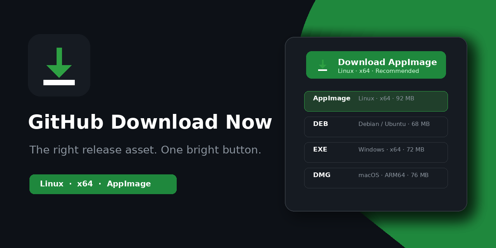

# GitHub Download Now

GitHub Download Now — открытое расширение для Chromium и Firefox, которое помогает скачать правильный файл приложения из публичных GitHub Releases.

Расширение добавляет заметную кнопку загрузки, определяет операционную систему и архитектуру процессора, рекомендует проверенный asset, объясняет установку или запуск и при желании следит за обновлениями выбранных публичных репозиториев.



## Основные возможности

- Определяет файлы для Windows, Linux, macOS и Android.
- Распознаёт x64, x86, ARM64 и ARM в именах файлов.
- Рекомендует EXE, MSI, DMG, PKG, AppImage, DEB, RPM, APK и другие распространённые форматы.
- Группирует альтернативы по платформам и учитывает предпочтительный формат пользователя.
- Показывает компактную кнопку рядом с выбранной версией на странице GitHub Releases.
- Позволяет переключать версии прямо в меню загрузки.
- Отклоняет внешние и межрепозиторные ссылки, которые имитируют путь GitHub Release.
- Не рекомендует автоматически контрольные суммы, подписи, SBOM, исходники и Android App Bundle для разработчиков.
- Находит отдельные документы по сборке и подходящие разделы `Building` внутри README, включая подраздел для текущей ОС.
- По ограниченному числу приоритетных ссылок из README находит инструкции отдельных компонентов, например `libpiper/README.md`, не сканируя всё дерево репозитория.
- Ссылается на оригинальную документацию GitHub, не придумывает и не выполняет команды.
- Показывает локальные подсказки по установке и запуску с точным именем скачиваемого файла.
- Ведёт необязательную локальную историю и следит только за проектами, выбранными пользователем.
- Проверяет подписки небольшими очередями и учитывает лимит GitHub API.
- Предлагает необязательное подключение GitHub без OAuth scopes для увеличения API-лимита; анонимный public-only режим остаётся полностью рабочим.
- Использует оригинальный фиолетовый знак ветвления и загрузки, сохраняя зелёный цвет для успешных действий.
- Имеет русский и английский интерфейс.

## Конфиденциальность и безопасность

В расширении нет аналитики, рекламы, ИИ-сервиса, собственного backend и удалённо исполняемого кода.

Поддерживаются только публичные репозитории; если GitHub не предоставляет явный признак публичности, расширение безопасно остаётся неактивным. Расширение читает публичные данные релиза с открытой страницы GitHub и при необходимости анонимно запрашивает публичные страницы `github.com`. Официальный GitHub REST API используется как запасной источник, для поиска документации по явному запросу пользователя и для добровольного слежения за обновлениями. Запросы страниц выполняются без cookie текущей GitHub-сессии.

Пользователь может добровольно подключить GitHub через официальный OAuth Device Flow без запрашиваемых scopes. Это увеличивает API-бюджет публичных запросов, но не включает работу с приватными репозиториями. Токен остаётся в `storage.local`, не синхронизируется, не передаётся разработчику и его локальная копия удаляется кнопкой **Отключить**. Полностью отозвать авторизацию можно в GitHub Settings → Applications. Хранилище расширения не является зашифрованным сейфом; подробности приведены в политике конфиденциальности.

Ссылки на релизы и исходники принимаются только после проверки домена, репозитория и структуры пути. История загрузок, подписки и сведения о лимите API остаются в `storage.local`; настройки могут синхронизироваться браузером через `storage.sync`.

Полная политика: [PRIVACY.md](PRIVACY.md).

## Поддерживаемые браузеры

- Chromium 121 и новее: Chrome, Edge, Brave, Vivaldi и совместимые браузеры.
- Firefox 140 и новее.
- Firefox для Android 142 и новее там, где браузер поддерживает дополнения.

Упоминание Android означает распознавание APK/APKS/AAB. Обычный Chrome для Android не устанавливает настольные расширения Chrome.

## Установка для разработки

### Chromium

1. Распаковать `github-download-now-chromium-v1.1.0.zip`.
2. Открыть `chrome://extensions`.
3. Включить **Режим разработчика**.
4. Нажать **Загрузить распакованное расширение**.
5. Выбрать каталог с `manifest.json`.

### Firefox

1. Распаковать `github-download-now-firefox-v1.1.0.zip`.
2. Открыть `about:debugging#/runtime/this-firefox`.
3. Нажать **Загрузить временное дополнение**.
4. Выбрать `manifest.json`.

Для постоянной установки Firefox требуется подпись Mozilla AMO.

## Языки

Расширение поставляется с английской и русской локалями. Тексты интерфейса используют стандартный формат WebExtensions `_locales`, а неподдерживаемые языки браузера переключаются на английский.

Чтобы добавить перевод, не требуется изменять логику приложения: достаточно скопировать английский каталог, перевести значения `message` и запустить проверку локалей. Подробности — в [инструкции для переводчиков](docs/TRANSLATING.md).

## Разработка

Точная инструкция для воспроизводимой сборки и рецензентов магазинов находится в [BUILDING.md](BUILDING.md).

Нужны Node.js 20+, Python 3.13 и Playwright для UI-тестов.

```bash
npm ci --ignore-scripts
npm run verify
```

`npm run verify` запускает проверку структуры проекта, ESLint, unit-тесты, проверку воспроизводимости архивов и Firefox lint. Полные UI-тесты:

```bash
python3 -m venv .venv-ui
source .venv-ui/bin/activate
python -m pip install -r requirements-dev.txt
python -m playwright install chromium
npm run test:ui
```

Перед публикацией release workflow повторно запускает обе группы проверок и выпускает артефакты с подписанной аттестацией происхождения сборки.

Сборка использует явный список разрешённых исходных файлов. Неизвестный файл внутри `src/` приводит к ошибке, а не попадает незаметно в магазинный ZIP. Временные метки ZIP берутся из `SOURCE_DATE_EPOCH` или текущего Git-коммита для воспроизводимой сборки.

## Разрешения

- `storage` — настройки, локальная история и слежение за обновлениями;
- `alarms` — пакетные проверки выбранных репозиториев;
- `notifications` — необязательные системные уведомления;
- `https://github.com/*` — интерфейс на публичных страницах репозитория и, только после явного действия пользователя, официальные endpoints OAuth Device Flow;
- `https://api.github.com/*` — публичные метаданные релизов, документы по сборке, состояние API-лимита и обновления отслеживаемых репозиториев.

Расширение не запрашивает браузерные разрешения на cookie, историю браузера или общую историю загрузок. Необязательная авторизация GitHub запускается только из настроек, не запрашивает OAuth scopes и подробно описана в [PRIVACY.md](PRIVACY.md).

## Проверка происхождения сборки

Релизы содержат SHA-256 и подписанные GitHub attestations:

```bash
sha256sum -c SHA256SUMS-v1.1.0.txt
gh attestation verify github-download-now-chromium-v1.1.0.zip -R ITDruss/github-download-now
```

## Участие в разработке

Особенно полезны примеры неверной рекомендации. Укажите URL публичного репозитория, определённую платформу, выбранный файл и ожидаемый вариант.

## Отказ от аффилированности

GitHub Download Now — независимый open-source проект, не связанный с GitHub, Inc. и не одобренный ею. GitHub является товарным знаком GitHub, Inc.

## Лицензия

MIT
